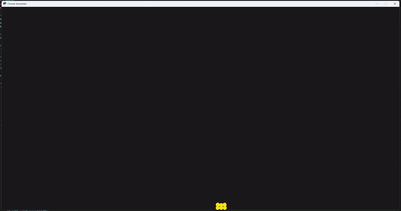

A simple 2D soft body simulator built using python and pyglet.

Uses particles connected by springs to simulate force between atoms.
Mouse can be used to toss the object/"cheese" around.
Object interacts with the edges of the window as if they are walls.

How to run:

Clone repo:
git clone https://github.com/Emilwikk/Cheese-Simulator
cd cheese simulator

Download pyglet:
pip install pyglet>=2.0

Run:
py main.py

